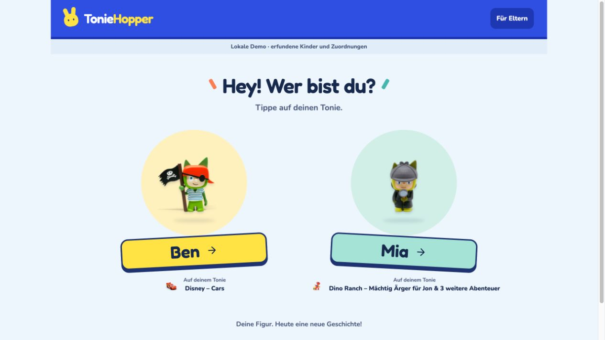
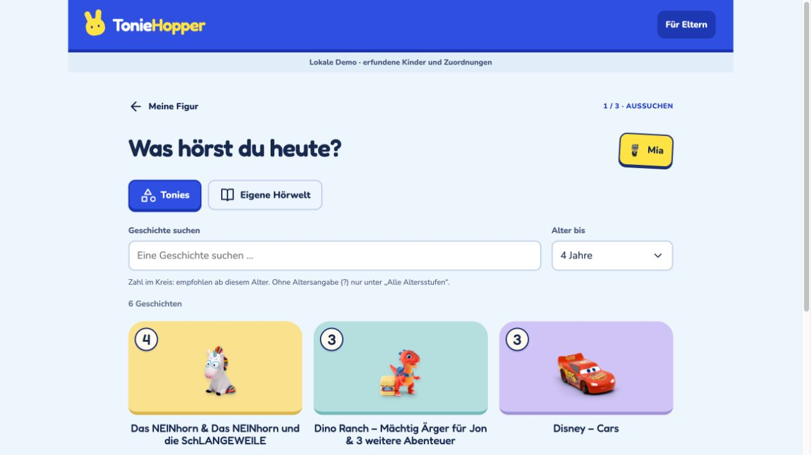
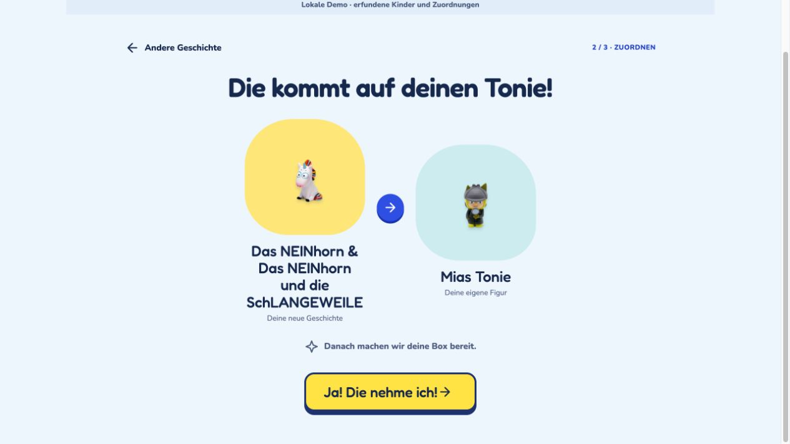
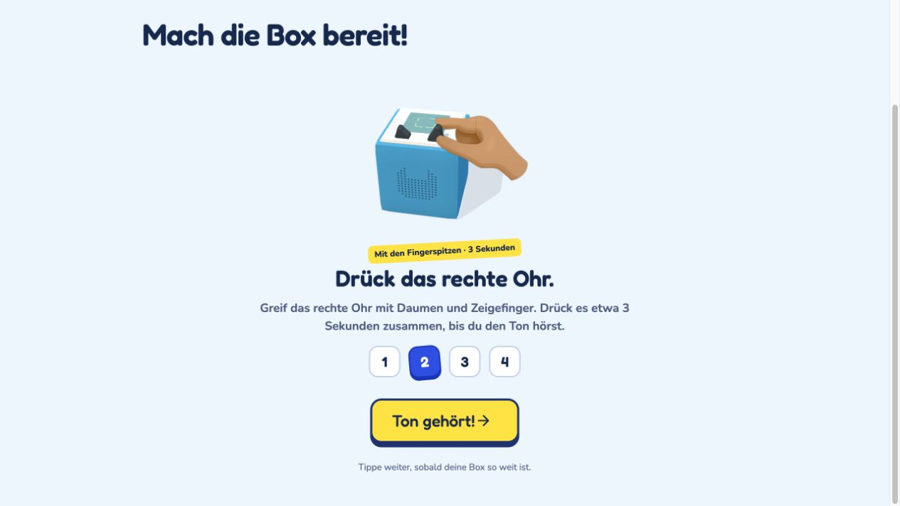

# TonieHopper

Kinder wählen selbst, welche Geschichte auf ihrer festen Tonie-Figur läuft. TonieHopper ist ein deutschsprachiges Plugin für [TeddyCloud](https://github.com/toniebox-reverse-engineering/teddycloud): Kind auswählen, Geschichte aussuchen, zuordnen und der animierten Anleitung an der Toniebox folgen.

Das Plugin wird direkt von TeddyCloud ausgeliefert und verwendet dessen API. Es braucht zur Laufzeit keinen zusätzlichen Server und lädt keine Schriften oder Skripte von einem CDN.

## Ein Blick in die App

Alle Screenshots stammen aus der mitgelieferten Offline-Demo. Namen, Profile und Gerätekennungen sind frei erfunden.

| Kind auswählen | Geschichten entdecken |
| --- | --- |
|  |  |
| Zuordnung bestätigen | Toniebox synchronisieren |
|  |  |

## Funktionen

- Mehrere Kinder mit jeweils einer fest zugeordneten physischen Tonie-Figur und optionaler Toniebox-Auswahl direkt aus TeddyCloud.
- Alphabetische Geschichtenliste, Textsuche und Scrollen ohne Seitenwechsel.
- Tonies und eine eigene Hörwelt für weitere TAF-Inhalte.
- Altersempfehlung im Kreis. **Alter bis → 4 Jahre** zeigt alle bekannten Empfehlungen bis einschließlich vier. Fehlende Angaben erscheinen als **?** und bleiben unter **Alle Altersstufen** sichtbar.
- Eltern können Geschichten gemeinsam für alle Kinder ausblenden. Neue Geschichten sind standardmäßig sichtbar.
- Die Suche nach der festen Figur umfasst alle physischen Figuren, auch Kreativ-Tonies.
- Animierte Anleitung zum Synchronisieren der Toniebox nach einer Zuordnung.

Die Altersempfehlungen stammen aus dem erweiterten Tonie-Katalog und werden anhand der Modellnummer zugeordnet. Die benötigten Daten liegen lokal im Plugin; Herkunft und Stand stehen in `plugin/toniehopper/assets/ages.json`.

## Ohne TeddyCloud ausprobieren

Python 3.9 oder neuer genügt:

```sh
python3 tools/serve-demo.py
```

Danach [die Offline-Demo öffnen](http://127.0.0.1:8770/). Sie verwendet ausschließlich Beispieldaten und simuliert Zuordnungen im Arbeitsspeicher. Sie verbindet sich mit keiner echten TeddyCloud. Details stehen in [docs/demo/README.md](docs/demo/README.md).

## Installieren

Paket erstellen:

```sh
python3 tools/build-plugin.py
```

Das Ergebnis liegt unter `dist/toniehopper.zip`. Es enthält das statische Plugin ohne persönliche Konfiguration. Auf dem TeddyCloud-Host oder einem Rechner mit verbundenen Volume-Ordnern installieren:

```sh
sh tools/install-plugin.sh \
  --plugins-dir /srv/teddycloud/plugins \
  --config-dir /srv/teddycloud/config \
  --config-mode copy
```

Die Pfade sind Beispiele und müssen auf die **bestehenden** Plugin- und Config-Verzeichnisse deiner Installation zeigen. Im Standardcontainer liegt das Plugin-Verzeichnis unter `/teddycloud/data/www/plugins`; die zugehörigen Hostpfade können anders lauten.

Bei der ersten Installation wird eine leere Konfiguration angelegt. Vorhandene Kinderzuordnungen bleiben bei Updates erhalten. Der vorherige Plugin-Ordner wird unter `config/toniehopper-backups/` gesichert.

Anschließend `/plugins/toniehopper/index.html` auf deiner TeddyCloud öffnen. Die direkte Seite lässt sich in Safari dem Home-Bildschirm hinzufügen.

## Kinder einrichten

1. Im Elternbereich **Kind hinzufügen** wählen.
2. Namen eingeben und die tatsächliche Figur über die Suche auswählen.
3. Den Entwurf übernehmen und unter **Konfiguration** exportieren.
4. Die exportierte Datei zentral installieren:

```sh
sh tools/install-plugin.sh \
  --plugins-dir /srv/teddycloud/plugins \
  --config-dir /srv/teddycloud/config \
  --config-mode copy \
  --import-config /pfad/zu/toniehopper.local.json
```

Danach die App neu laden. Änderungen im Elternbereich bleiben bis zum Import ein Entwurf. Eine Anleitung zu Dateien, Feldern, Migration und SMB findest du unter [Konfiguration](docs/configuration.md).

## Verhalten und Grenzen

Die Kategorie **Tonies** verwendet den Standard-Tonie-Katalog der eigenen TeddyCloud. Ein gesetztes Modell allein genügt nicht; das Modell muss im Katalog vorkommen. Fehlt bei einem archivierten Original aus der Bibliothek die Modellangabe, wird es nur bei einer exakten Übereinstimmung von Audio-ID **und** SHA-1-Prüfsumme als Tonie erkannt. Systemtöne werden ausgeblendet.

Ist im Kinderprofil eine Toniebox ausgewählt, lädt TonieHopper Figuren und Tonie-Geschichten ausschließlich aus dem zugehörigen TeddyCloud-Overlay. Das Auswahlfeld listet **Nicht zugeordnet** sowie alle von TeddyCloud gemeldeten Boxen. Ohne Zuordnung wird der Standard-Inhaltsbereich verwendet. Die gemeinsame **Eigene Hörwelt** aus der TAF-Bibliothek bleibt davon unberührt.

Kopien werden nur anhand derselben gültigen Audio-ID **und** SHA-1-Prüfsumme aus dem TAF-Header zusammengeführt. Gleiche Titel, Modelle oder Bilder reichen nicht aus. Verschiedene Geschichten eines Sets bleiben dadurch getrennt. Die Quelldateien werden nicht verändert oder gelöscht.

Eine erfolgreiche Zuordnung bestätigt das Speichern auf TeddyCloud. Die Synchronisation mit der Toniebox erfolgt anschließend anhand der Anleitung; das Plugin erkennt den Refresh noch nicht automatisch.

Der Elternbereich hat keine PIN-Sperre. Das Plugin richtet sich an ein vertrauenswürdiges Heimnetz. Die Oberfläche ist für ältere Safari-Versionen ausgelegt; ein Test auf dem tatsächlichen iPad bleibt erforderlich.

## Entwickeln

```text
plugin/toniehopper/       Installierbares Plugin
config/toniehopper.json   Leere Konfigurationsvorlage
docs/demo/               Anonyme Beispieldaten und Bilder
docs/screenshots/        Repo-Screenshots
tests/                   Tests mit synthetischen Kennungen
tools/                   Paketbau, Installation und lokale Vorschau
```

Unit-Tests benötigen Node.js:

```sh
node --test tests/api.test.js tests/config.test.js tests/catalog.test.js tests/figures.test.js
```

Weitere Hinweise zur Vorschau mit der eigenen TeddyCloud, Browser-Tests, Animation und Altersdaten stehen unter [Entwicklung](docs/development.md). Persönliche Exporte und Prüfberichte gehören in `.local/` oder `*.local.json`; diese Pfade sind von Git ausgeschlossen. Die Konfigurationsvorlage bleibt leer.

TonieHopper ist ein unabhängiges Community-Projekt. Hinweise zu fremden Schriften, Illustrationen und Beispielbildern stehen unter [Quellen](docs/credits.md).
